⛪ YJ Team Project1 : Team Renaissance

# ✨ 동성로 소개 웹사이트 제작 프로젝트 ✨  

제작기간 : " 23.07.05 - 23.08.11 "  

### Demo : https://dongseongnorang-project.netlify.app/

---

## 💻 목업 사진

 

    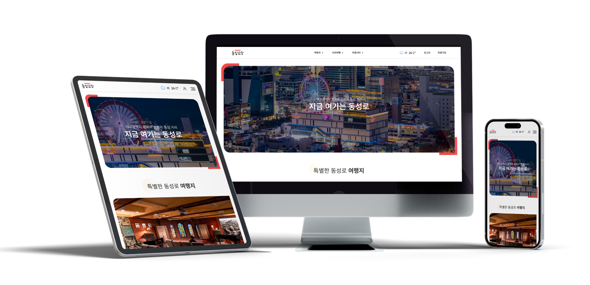

---

## 👨🏻‍🤝‍👨 팀원 소개

 

    

---

## 🧾 기획 배경

 

    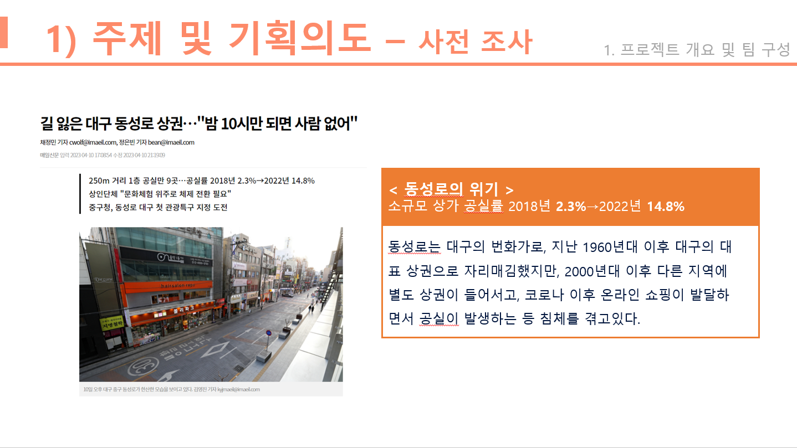

 

    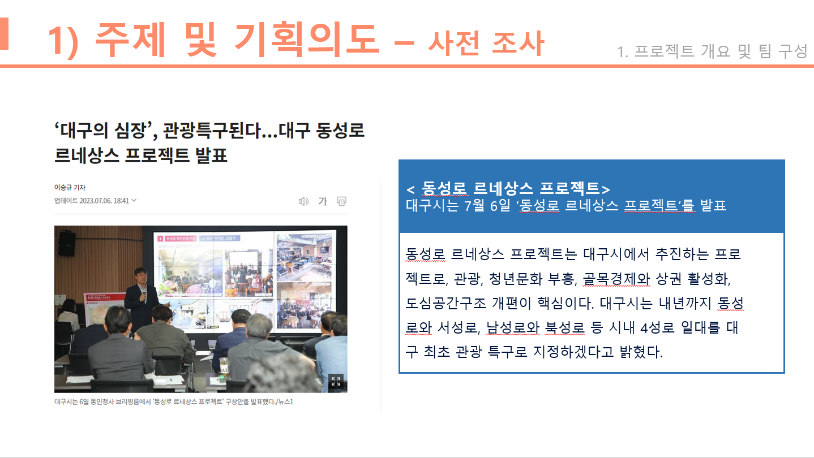

 

- 유사 사이트의 문제점

 

    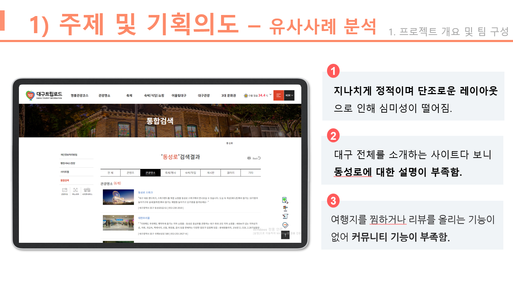

---

## 📅 개발 일정

 

    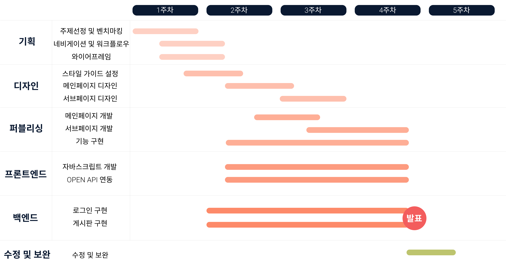

---

## 💻 개발 환경

 

    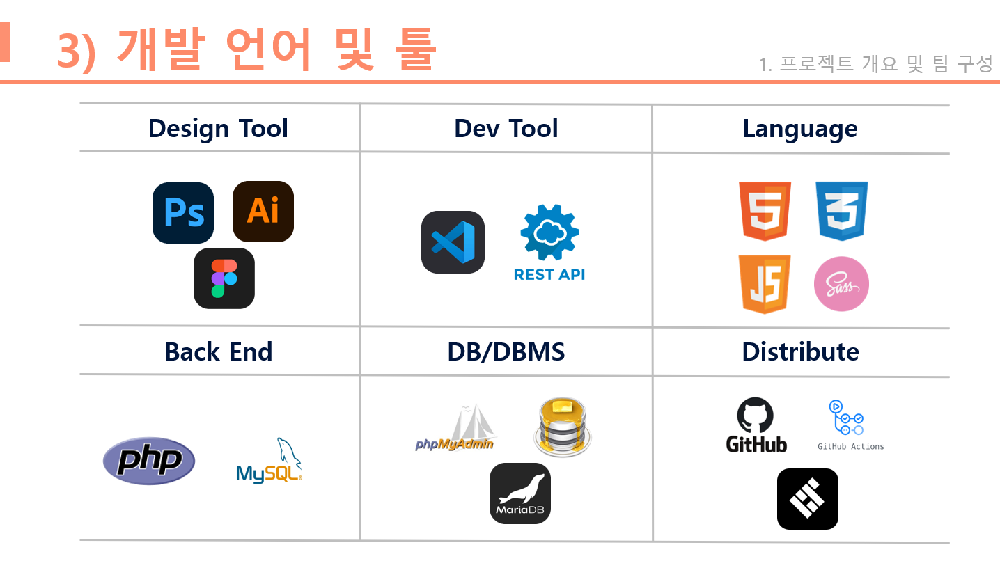

---

## 📲 구현 기능

 

1.  Open API 활용 \_ youtube API를 활용

    

        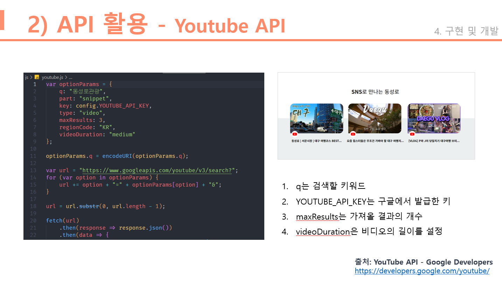
    

 

2.  Open API 활용 \_ openweather API를 활용

    

        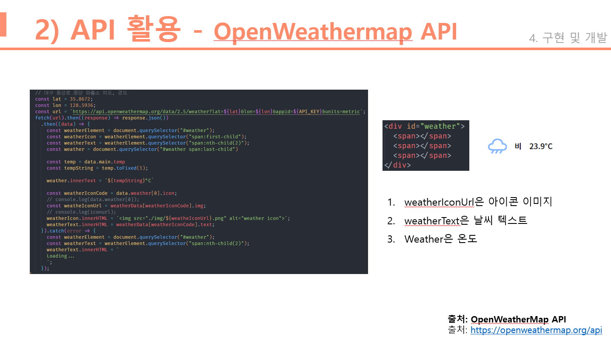
    

 

3.  Open API 활용 \_ 공공 데이터 API를 활용

    

        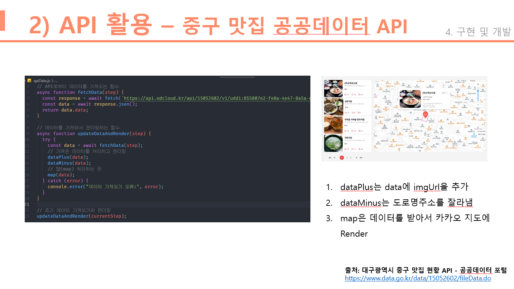
    

 

1.  Open API 활용 \_ kakao map API를 활용

    

        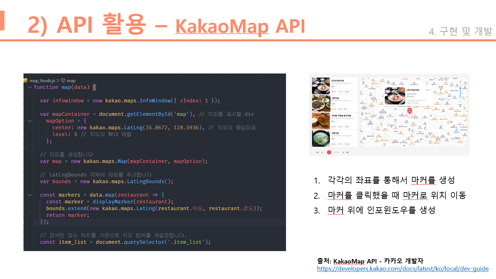
    

 

---

## 👨‍💻 자체 평가 및 의견

 

    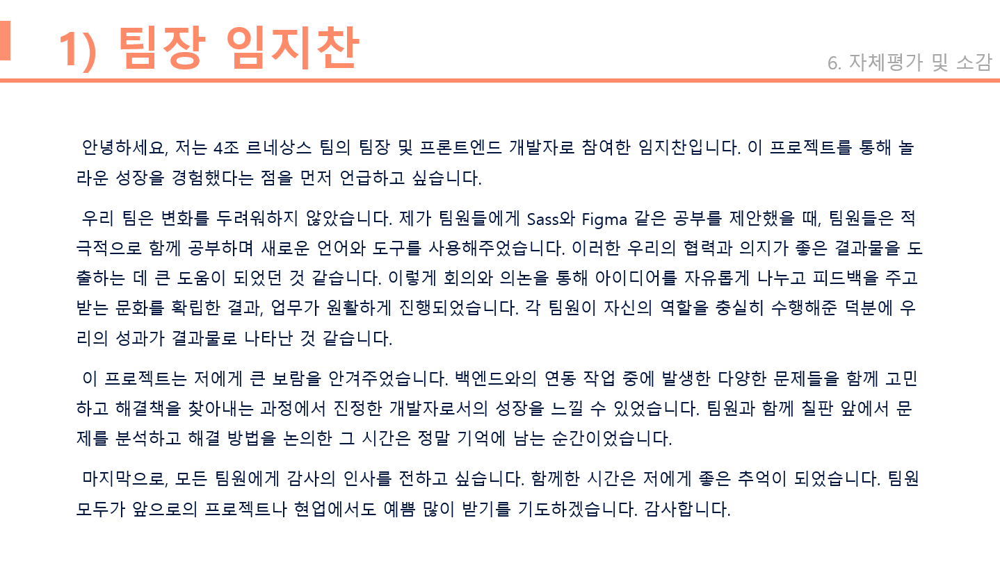
    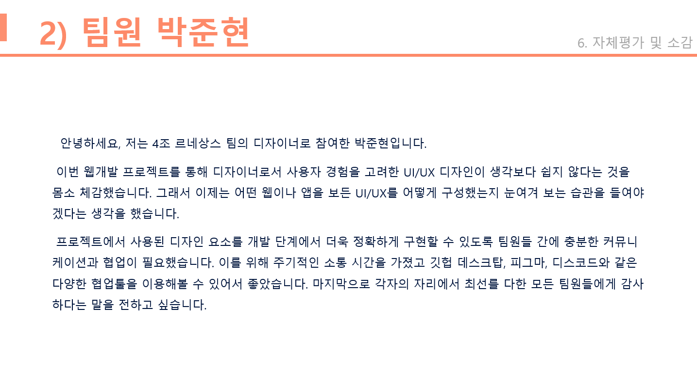
    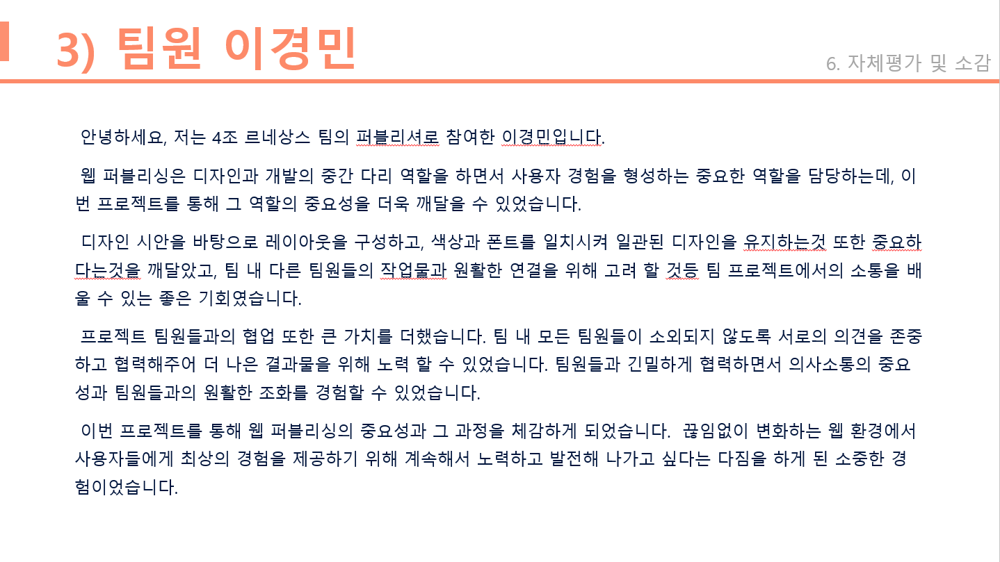
    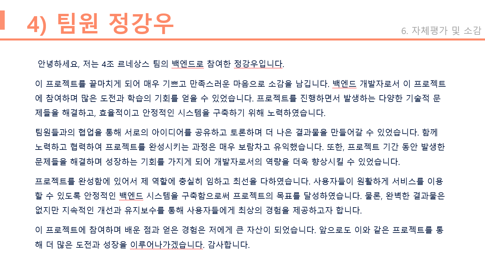

---

 

## END
